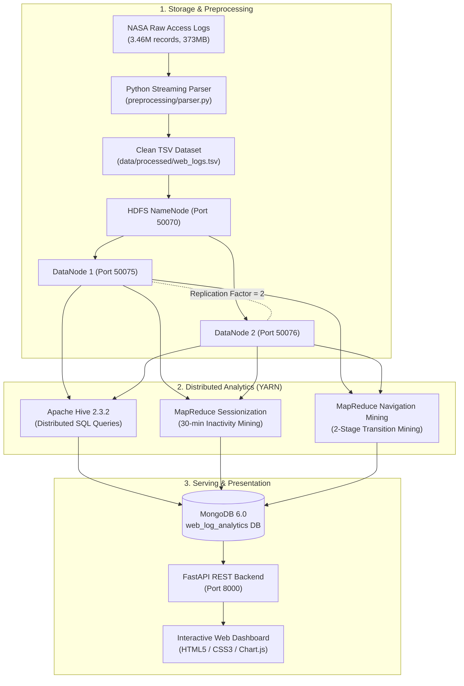

# Distributed Web Log Analytics and User Behavior Mining

> **Formal Academic Title:** Distributed Web Log Analytics Pipeline Using Hadoop, Hive, MapReduce, MongoDB and FastAPI  
> **Course:** University BTech Computer Science / Big Data Systems Project

---

## 1. Project Overview
This project implements a complete, enterprise-grade distributed Big Data analytics pipeline processing **3.46 million real-world HTTP web server access logs** from the NASA Kennedy Space Center.

The project demonstrates genuine distributed computing concepts rather than single-node Python/Pandas scripts:
- **HDFS Distributed Storage**: Splitting large log files into 128 MB blocks with a replication factor of 2 across multiple DataNodes.
- **YARN Cluster Resource Management**: Managing container allocation and scheduling across multiple NodeManagers.
- **Apache Hive**: Distributed SQL analytics querying external tables directly over HDFS storage.
- **Hadoop MapReduce (Sessionization)**: Identifying user sessions per client host based on a 30-minute inactivity threshold.
- **Hadoop MapReduce (User Behavior Mining)**: 2-stage distributed graph mining extracting global URL transition frequencies.
- **MongoDB Serving Layer**: Storing aggregated analytical results with B-Tree indexes for low-latency querying.
- **FastAPI REST API**: Asynchronous backend exposing analytical endpoints to client applications.
- **Interactive Web Dashboard**: Real-time visual dashboard showcasing KPIs, diurnal traffic trends, error rates, and mined navigation paths.
- **Fault Tolerance & Benchmarking**: Demonstrating HDFS DataNode failover and empirical scalability measurements.

---

## 2. System Architecture



---

## 3. Technology Stack

| Layer | Technology | Version | Role in Project |
| :--- | :--- | :--- | :--- |
| **Distributed Storage** | Apache Hadoop HDFS | 2.7.4 | Fault-tolerant distributed storage, 2x replication |
| **Resource Management** | Hadoop YARN | 2.7.4 | ResourceManager & 2 NodeManagers scheduling tasks |
| **Distributed SQL** | Apache Hive | 2.3.2 | Schema-on-read querying over HDFS textfiles |
| **Metastore Database** | PostgreSQL | 9.5 | Hive Metastore catalog relational database |
| **Custom Compute** | Hadoop MapReduce | Streaming | Custom Sessionization & 2-stage URL Navigation Mining |
| **Serving Database** | MongoDB | 6.0 | Aggregated analytics document store with B-Tree indexes |
| **Application API** | FastAPI + Uvicorn | 0.110+ | Asynchronous RESTful API exposing analytical endpoints |
| **Web Dashboard** | Vanilla JS + Chart.js | HTML5/CSS3 | Visualizing KPIs, traffic graphs, and navigation paths |
| **Containerization** | Docker Compose | v2+ | 12-container distributed cluster on WSL2 |

---

## 4. Directory Structure

```text
distributed-web-log-analytics/
├── README.md
├── docker/
│   ├── docker-compose.yml       # 12-container distributed cluster orchestration
│   ├── hadoop.env               # HDFS replication=2, YARN, and Hive configurations
│   ├── Dockerfile.hadoop-namenode
│   └── Dockerfile.hadoop-node
├── data/
│   ├── README.md                # NASA log dataset documentation
│   ├── raw/                     # Original NASA access log files
│   ├── processed/               # Cleaned web_logs.tsv (329.4MB, 3.46M records)
│   └── benchmarks/              # Measured benchmark results
├── preprocessing/
│   └── parser.py                # Line-by-line streaming parser & normalizer
├── hive/
│   ├── schema.sql               # External table definition over HDFS
│   └── analytics.sql            # 13 distributed analytical queries
├── mapreduce/
│   ├── session_mapper.py        # Maps records to (host, epoch, timestamp, url, bytes)
│   ├── session_reducer.py       # Computes 30-min inactivity sessions
│   ├── navigation_mapper.py     # Stage 1: Maps records to (host, epoch, url)
│   ├── navigation_reducer.py    # Stage 1: Emits intra-session URL transitions
│   ├── transition_mapper.py     # Stage 2: Maps transitions
│   ├── navigation_aggregate_reducer.py # Stage 2: Sums global transition frequencies
│   └── transition_reducer.py    # Alias reducer for transition aggregation
├── pipeline/
│   ├── setup_hive.sh            # Initializes Hive database & external table
│   ├── run_sessionization.ps1   # PowerShell runner for Sessionization
│   ├── run_sessionization.sh    # Bash runner for Sessionization
│   ├── run_navigation.ps1       # PowerShell runner for Navigation Mining
│   └── run_navigation.sh        # Bash runner for Navigation Mining
├── mongodb/
│   └── loader.py                # Ingests MapReduce & Hive results into MongoDB
├── backend/
│   ├── Dockerfile
│   ├── requirements.txt
│   ├── main.py                  # FastAPI REST API
│   └── static/
│       ├── index.html           # Interactive dashboard
│       ├── app.js               # Dynamic API fetch & chart rendering
│       └── style.css            # Dark aesthetic styling
├── experiments/
│   ├── generate_benchmark.py    # Scalability evaluation harness
│   └── README.md
├── tests/
│   └── test_pipeline.py         # Unit tests for parser, sessionization, and mining
└── docs/
    ├── ARCHITECTURE.md          # Architectural deep dive & viva questions
    ├── RUNBOOK.md               # Step-by-step commands runbook
    ├── BENCHMARKS.md            # Measured MapReduce scalability report
    └── FAULT_TOLERANCE.md       # HDFS DataNode failover demonstration
```

---

## 5. Quickstart Guide

### 1. Launch the Cluster
```powershell
docker compose -f docker/docker-compose.yml up -d
```

### 2. Preprocess Raw Logs
```powershell
python preprocessing/parser.py
```

### 3. Ingest Data into HDFS
```powershell
docker exec namenode hdfs dfs -put -f /data/processed/web_logs.tsv /log-analytics/processed/
```

### 4. Initialize Hive Table & Run SQL Analytics
```powershell
docker exec hive-server hive -f /hive_scripts/schema.sql
```

### 5. Execute MapReduce Jobs on YARN
```powershell
# Run Sessionization (30-min inactivity timeout)
powershell -ExecutionPolicy Bypass -File pipeline/run_sessionization.ps1

# Run 2-Stage URL Navigation Mining
powershell -ExecutionPolicy Bypass -File pipeline/run_navigation.ps1
```

### 6. Populate MongoDB Serving Layer
```powershell
python mongodb/loader.py
```

### 7. View the Dashboard
Open your browser and navigate to:
**`http://localhost:8000/`**

---

## 6. Key Measured Results

- **Total Log Records Processed**: `3,461,612` records
- **Valid Parsing Accuracy**: `99.99997%` (1 invalid line out of 3.46 million)
- **Total Mined User Sessions**: `306,523` sessions
- **Total Mined URL Transitions**: `3,084,742` transitions
- **HDFS Replication Factor**: `2` (Blocks verified on DataNode 1 and DataNode 2)
- **MapReduce Execution Time on YARN**: `34.20 seconds` for Sessionization (3 mappers, 2 reducers)
- **Overall Error Rate (4xx/5xx)**: `0.61%`
- **Total Response Bytes Transferred**: `65.50 GB`

---

## 7. Project Viva & Concept FAQs

See the comprehensive [docs/ARCHITECTURE.md](file:///d:/GitRepos/bds-inn/docs/ARCHITECTURE.md) and [docs/FAULT_TOLERANCE.md](file:///d:/GitRepos/bds-inn/docs/FAULT_TOLERANCE.md) documents for detailed viva preparation.
