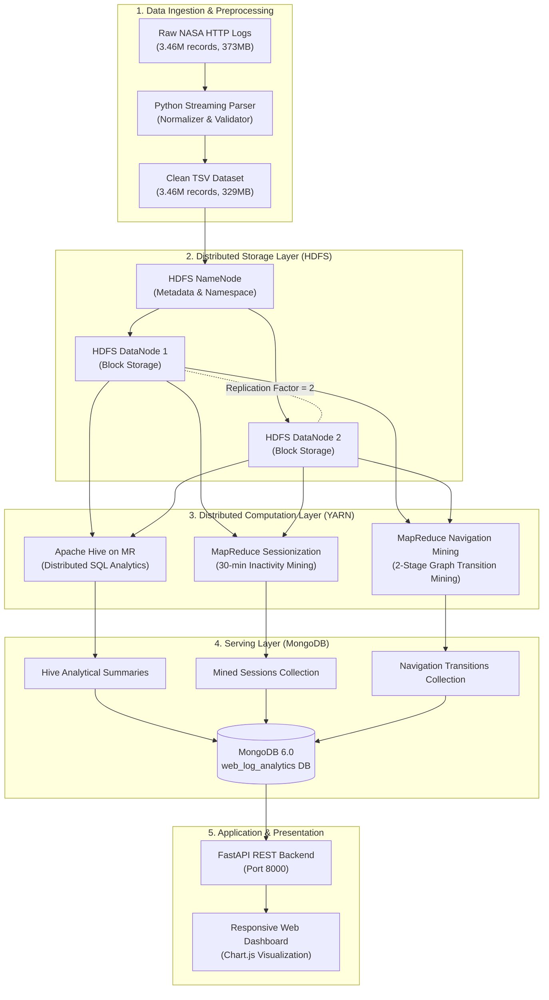

# Distributed Web Log Analytics Architecture

## 1. System Overview
This project implements an end-to-end Big Data distributed processing and analytics pipeline designed for university BTech Computer Science / Big Data Systems curriculum. It takes real-world web server access logs (NASA Kennedy Space Center HTTP Logs), ingests them into **Hadoop Distributed File System (HDFS)** with replication, executes distributed SQL queries with **Apache Hive**, performs sessionization and URL navigation graph mining with **Hadoop MapReduce on YARN**, serves aggregated analytical results through **MongoDB**, and provides real-time access via a **FastAPI** backend and responsive **Web Dashboard**.

---

## 2. End-to-End Architecture & Data Flow

---

## 3. Component Deep Dive

### 3.1 Distributed Storage: HDFS
- **NameNode**: Maintains the file system namespace, directory tree, and mapping of file blocks to DataNodes. It stores file metadata in memory and persists state through `fsimage` and `edits`.
- **DataNodes (2 Nodes)**: Store and retrieve physical data blocks (128 MB default chunk size).
- **Block Replication**: Replication factor is explicitly set to `2`. When `web_logs.tsv` (329.4 MB) is stored, HDFS splits it into 3 blocks:
  - Block 0 (128 MB): Replicated on DataNode 1 and DataNode 2.
  - Block 1 (128 MB): Replicated on DataNode 1 and DataNode 2.
  - Block 2 (73.4 MB): Replicated on DataNode 1 and DataNode 2.

### 3.2 Cluster Resource Management: YARN
- **ResourceManager**: The master daemon allocating cluster CPU and memory resources across all applications.
- **NodeManagers (2 Worker Nodes)**: Daemon running on each worker container, tracking node health and launching task containers.

### 3.3 Distributed SQL: Apache Hive
- **Hive Metastore**: Central repository storing schema mappings and table definitions in an external **PostgreSQL** database.
- **HiveServer2**: Service exposing JDBC/ODBC interfaces allowing clients to submit HiveQL queries.
- **External Table (`web_logs`)**: Points directly to `/log-analytics/processed` in HDFS without copying or duplicating raw data.

### 3.4 Custom MapReduce Processing
- **Sessionization**:
  - **Mapper**: Reads TSV records, emits `(host, epoch, timestamp, url, bytes)`.
  - **Shuffle & Sort**: Hadoop automatically partitions records by `host` and groups them together.
  - **Reducer**: Reconstructs sessions per host using a 30-minute inactivity threshold. Emits session duration, request counts, and byte volume.
- **URL Navigation Graph Mining**:
  - **Stage 1 (Extraction)**: Emits intra-session URL transitions `(source_url, destination_url, 1)`.
  - **Stage 2 (Aggregation)**: Sums global transition frequencies across all sessions.

### 3.5 Serving Layer: MongoDB
- Stores aggregated analytical results, top pages, hourly traffic patterns, mined sessions, and URL transitions.
- Utilizes B-Tree indexes on `request_count`, `session_id`, `count`, and `hour` for sub-millisecond API queries.

### 3.6 API & Visualization: FastAPI + Dashboard
- **FastAPI**: Lightweight, asynchronous Python REST API querying MongoDB. Never touches raw logs directly.
- **Dashboard**: Pure HTML5/CSS3/JavaScript interface visualizing KPIs, Chart.js traffic/error distributions, and mined transition patterns.

---

## 4. Viva / Oral Examination Cheatsheet

1. **What is HDFS and why are blocks replicated?**
   - HDFS is a distributed, user-space filesystem designed for high-throughput batch reads over commodity hardware. Files are divided into 128 MB blocks and replicated across multiple DataNodes (factor 2 in this project) to guarantee fault tolerance if a node crashes.
2. **What is the difference between NameNode and DataNode?**
   - The NameNode holds the directory namespace, metadata, and block locations in RAM. DataNodes store the physical block data on disk and report block lists to the NameNode via regular heartbeats.
3. **What is the difference between Hive and MapReduce?**
   - MapReduce is a procedural distributed compute framework requiring explicit Mapper and Reducer algorithms. Hive is a declarative SQL abstraction layer that parses HiveQL, optimizes an execution plan, and compiles queries into underlying MapReduce jobs.
4. **Why use MongoDB after Hadoop instead of querying Hadoop directly?**
   - Hadoop and HDFS are optimized for high-latency, high-throughput batch processing over terabytes of data. MongoDB is an OLTP/Serving document store optimized for low-latency point lookups and aggregations required by real-time dashboards.
5. **Why use a 30-minute inactivity threshold for sessionization?**
   - The 30-minute threshold is the web analytics industry standard (used by Google Analytics and W3C). If a user remains idle for more than 30 minutes, subsequent requests represent a new visit/intent.
